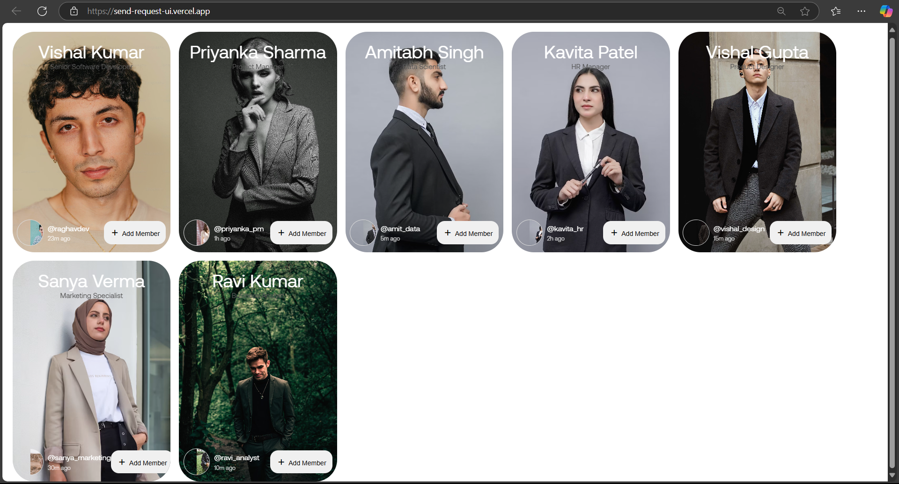

# 🚀 Send Request UI

Welcome to the **Send Request UI** project! This application provides an interactive interface for sending user requests, utilizing JSON data to dynamically generate user cards.

## 🌟 Live Demo

Experience the application live: [Send Request UI](https://send-request-ui.vercel.app/)

## 🖼️ Preview



## 🛠️ Features

- **Dynamic User Cards:** Generates user request cards from JSON data.
- **Interactive Interface:** Allows users to send requests seamlessly.
- **Responsive Design:** Optimized for various devices and screen sizes.

## 🧑‍💻 Technologies Used

- **HTML5 & CSS3:** Structure and styling.
- **JavaScript (ES6+):** Dynamic content generation and interactivity.
- **JSON:** Data handling for user information.

## 🚀 Getting Started

Follow these steps to run the project locally:

1. **Clone the Repository:**
   ```bash
   git clone https://github.com/Krunal022/send-request-ui.git
  
